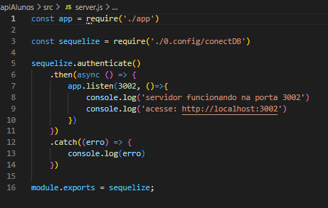
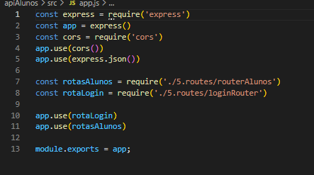
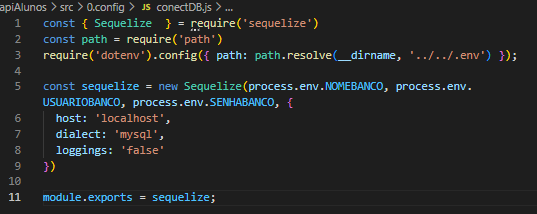
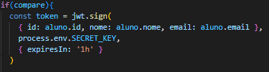
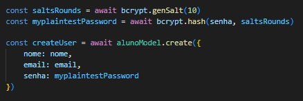
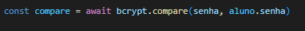
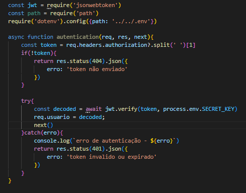
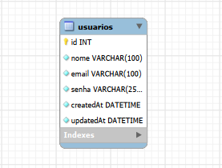
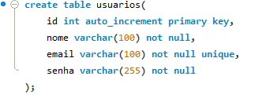
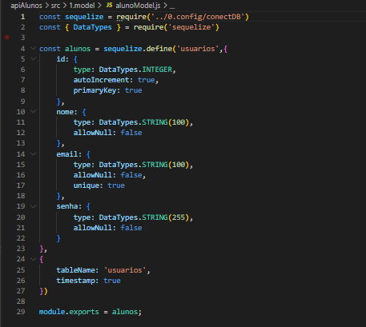

# Mini projeto - login e criação de alunos

O objetivo desse projeto é testar meus conhecimentos full stack no desenvolvimento web, onde eu utilizo JavaScript como linguagem de programação e as seguintes tecnologias/frameworks:

## Back-End

```
Node.js
Express.js
Cors
Jsonwebtoken
Bcrypt
Dotenv
Mysql2
Sequelize
Nodemon
```

O Back-End foi feito utilizando da arquitetura MVC (Model-View-Controller), dividindo a aplicação em componentes:

- Model
- Controller
- Rotas / Serviços

### Estrutura de diretório

```
project-root/
├── src/
│   ├── config/
│   ├── controllers/
│   ├── middleware/
│   ├── models/
│   ├── routes/
│   ├── services/
│   ├── app.js
│   └── server.js
├── .env
├── .gitignore
└── package.json
```

<details>
<summary>Express.js</summary>

> Uso do framework Express.js para criação do servidor de rotas de login e criação de usuários.

<details>
<summary>Server.js</summary>

### Server.js



Esse é o `server.js` da API alunos:

- Importa o `app` e o `sequelize` (instância de conexão configurada em `0.config/conectDB`)
- Chama `sequelize.authenticate()` para testar/confirmar a conexão com o banco de dados
- Se a conexão der certo (`.then`), sobe o servidor com `app.listen(3002)` e loga mensagens confirmando que está rodando
- Se der erro (`.catch`), loga o erro no console
- Exporta o `sequelize` no final

</details>

<details>
<summary>App.js + Cors</summary>

### App.js



Essa é a estrutura principal do `app.js` no projeto da API alunos:

- Importa e configura o Express como servidor
- Usa o middleware `cors` para permitir requisições de outras origens
- Usa `express.json()` para interpretar corpos de requisição em JSON
- Importa duas rotas: `routerAlunos` (rotas de alunos) e `loginRouter` (rota de login), ambas dentro de `5.routes/`
- Registra essas rotas na aplicação com `app.use()`
- Exporta o `app` no final, para ser usado (provavelmente) em um arquivo de inicialização do servidor (tipo `server.js`)

</details>

</details>

<details>
<summary>Camadas de segurança</summary>

<details>
<summary>Dotenv</summary>



Uso do Dotenv para evitar vazamentos de credenciais do banco de dados, evitando um possível vazamento de dados presentes no banco.

---



Também foi usado o Dotenv na secret password do JWT, possibilitando a segurança do token.

</details>

<details>
<summary>Bcrypt</summary>



Primeiramente eu usei o Bcrypt para criptografar a senha cadastrada do usuário, fazendo com que ela não vá em texto puro para o banco de dados.

---



Um exemplo de como o Bcrypt é usado no login: na imagem é mostrada a senha digitada pelo usuário sendo comparada com a senha criptografada armazenada no banco de dados.

</details>

<details>
<summary>JsonWebToken (JWT)</summary>


Com o objetivo de criar rotas privadas, eu usei o JWT para tornar isso possível através dos seus tokens.



Também foi usado um middleware de autenticação com JWT: ele recebe o token que fica no header `Authorization`, decodifica o payload e verifica a assinatura para validar o usuário.

</details>

</details>

<details>
<summary>Banco de dados</summary>

### Diagrama



Nesse mini projeto eu fiz somente com uma única tabela; caso houvesse outras, eu poderia adicionar os relacionamentos entre elas etc.

---

<details>
<summary>MySQL</summary>



Essa foi a estrutura da tabela usada.

Obs: o `UNIQUE` no email foi usado para evitar que um único email criasse vários usuários.

---

### MySQL2

Foi usado o pacote npm `mysql2` para representação da tabela de usuários, possibilitando o trabalho do Sequelize.



</details>

<details>
<summary>Sequelize</summary>

## alunoModel.js


- Importa a instância `sequelize` e o `DataTypes` do pacote `sequelize`
- Usa `sequelize.define('usuarios', {...})` para mapear a tabela `usuarios` do banco em um Model do Sequelize (ORM)
- Define as colunas e suas regras: `id` (INTEGER, autoIncrement, primaryKey), `nome` (STRING(100), obrigatório), `email` (STRING(100), obrigatório e único), `senha` (STRING(255), obrigatório)
- Configura `tableName: 'usuarios'` e exporta o model como `alunos`, permitindo usar métodos como `findAll()` e `create()` sem escrever SQL manualmente

---

## conectDB.js


- Importa o `Sequelize` do pacote `sequelize` e configura o `dotenv`, apontando para o `.env` na raiz do projeto
- Cria a instância `sequelize`, passando nome do banco, usuário e senha vindos das variáveis de ambiente (`NOMEBANCO`, `USUARIOBANCO`, `SENHABANCO`)
- Define o `host` (`localhost`) e o `dialect` (`mysql`), informando ao Sequelize que o banco é MySQL
- Exporta essa instância, reutilizada no `server.js` (para `authenticate()`) e nos models


</details>

</details>